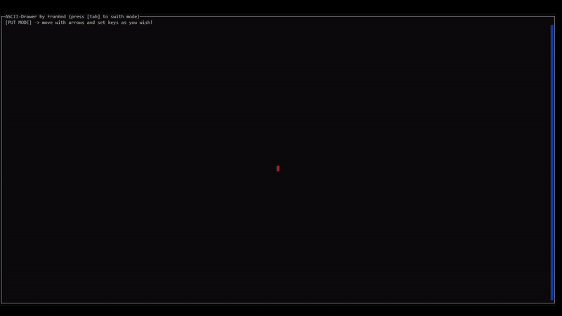

# A TUI software to draw basics ASCII diagrams.


## Introduction

A minimalist and lightweight ascii diagram editor working with ncurses.<br>
It features an easy to use interface for drawing rects, lines, arrows, text...<br>
and doing things such as copy-pasting, filling selection...<br>
It's written in C because first I like C, C is beautiful, C is simple,<br>
C's memmory management is challenging and it compiles fast.<br>
<br>
This project is not intended to be a good text editor but a good ascii diagram drawer.<br>
Even if I'm trying to improve the `TEXT` mode as much as possible :)<br>
The main purpose of this project is to help writing documentation for devs<br>
but it can also be used to draw a tui videogame map!<br>

## How to use

### How to setup

To install dependancies:

* `sudo apt-get install libncurses5-dev libncursesw5-dev`

To build the project:

* `git clone git@github.com:Fran6nd/tui-diagdrawer.git`
* `cd tui-diagdrawer`
* `make`
* `./tui-diagdrawer myfile`

To install:

* `sudo make install`

### Common operations

* `[tab]`: enter/exit the menu.
* `[u]`: undo.
* `[ctrl] + [r]`: redo.
* `[arrow]`: move the cursor.
* `[ctrl] + [arrow]`: move the cursor faster.

## Contributing

Any contribution is appreciated to improve the software's capabilities/architecture<br>
In case af style changes, of course it's welcome but do not forget to explain why :)<br>

## TODO

* Multiple files editing.
* Finding words, chunk...
* Display strings bigger than screen in help viewport.
* Improve the text editor.
* Enable LUA scripting
* Enable the user to change the name of the outpout file.

# Here is what we can do:

```
 | +-----------+
 | |rects      |-------+
 | +-----------+       |
 |                     |
 | lines:              |
 |  |   |              |
 |  |   |              |
 |  |   |<---arrows----+
 |  +---+
 |
 |  fill:
 |  **********
 |  **********
 |  **********
 |  **********
 |  copy past:
 |  ********** ********** **********
 |  ********** ********** **********
 |  ********** ********** **********
 |  ********** ********** **********
 +-----------------------------------+
 ```
